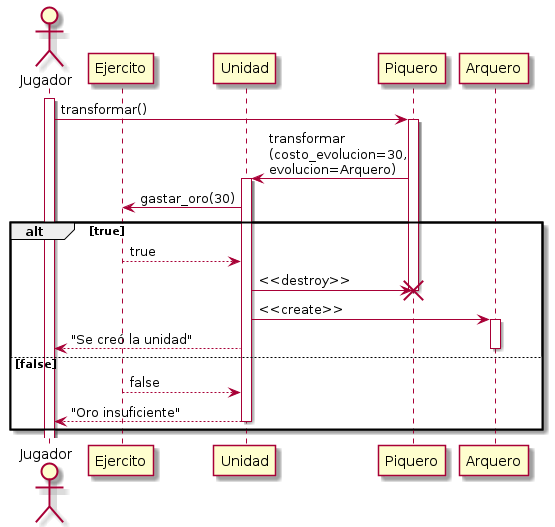
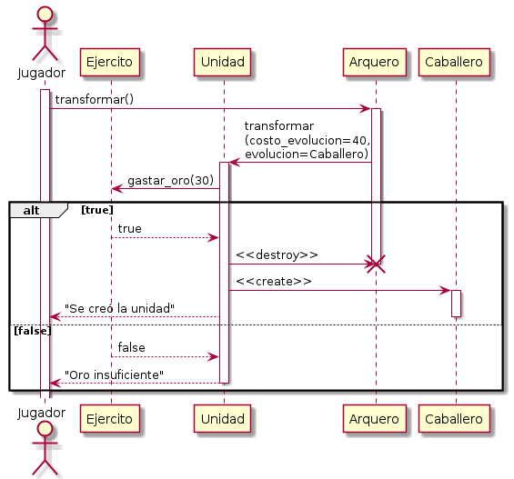
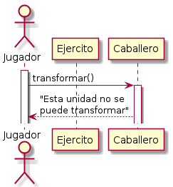

# Operación "transformar unidad"

[Volver](README.md)

## Casos de uso

Para los tres casos se supone un *happy path* con un *alternate path* en los casos 1 y 2 (paso 4).

Se han establecido las precondiciones en los pasos 1 de cada caso. Omitir esto puede dar paso a pensar en otros *alternate paths* (por ejemplo, qué ocurre cuando se pide transformar una unidad inexistente)

### Caso 1

1. Se tiene un ejército de ingleses con 10 piqueros, 10 arqueros y 10 caballeros.
3. El jugador elige transformar un piquero.
4. Se intentan descontar 30 unidades de oro al ejército al cual pertenece el piquero. 
   1. Si esta operación retorna un valor falso, se muestra el mensaje "Oro insuficiente" un mensaje y no se sigue adelante .
5. Se intercambia un piquero por un arquero en el ejército (es decir, se destruye el piquero y se crea un arquero).

### Caso 2

1. Se tiene un ejército de ingleses con 10 piqueros, 10 arqueros y 10 caballeros.
3. El jugador elige transformar un arquero.
4. Se intentan descontar 40 unidades de oro al ejército al cual pertenece el piquero. 
   1. Si esta operación retorna un valor falso, se muestra el mensaje "Oro insuficiente" un mensaje y no se sigue adelante .
5. Se intercambia un arquero por un caballero en el ejército (es decir, se destruye el piquero y se crea un arquero).

### Caso 3

1. Se tiene un ejército de ingleses con 10 piqueros, 10 arqueros y 10 caballeros.
3. El jugador elige transformar un caballero.
4. Se devuelve el mensaje "No se puede transformar esta unidad".

## Diagramas de secuencia

### Caso 1

### Caso 2

### Caso 3

