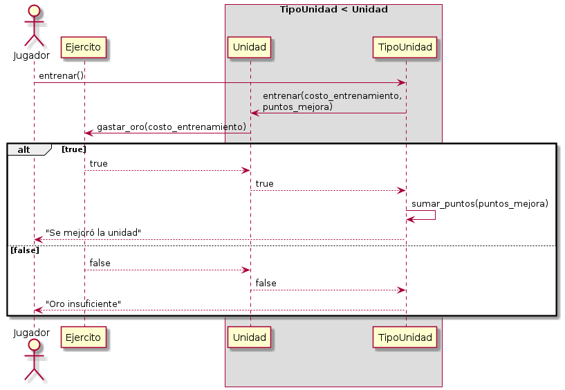

# Operación "entrenar unidad"

[Volver](../ejercitos/README.md)

## Caso de uso

1. Se tiene un ejército de ingleses con 10 piqueros, 10 arqueros y 10 caballeros.
2. El jugador elige entrenar una unidad.
3. Se intentan descontar las unidades de oro que correspondan al costo de entrenamiento de la unidad.
   1. Si esta operación retorna un valor falso, se muestra el mensaje "Oro insuficiente y no se sigue adelante.
4. Se suman los puntos de fuerza que correspondan a la unidad.

## Diagrama de secuencia

