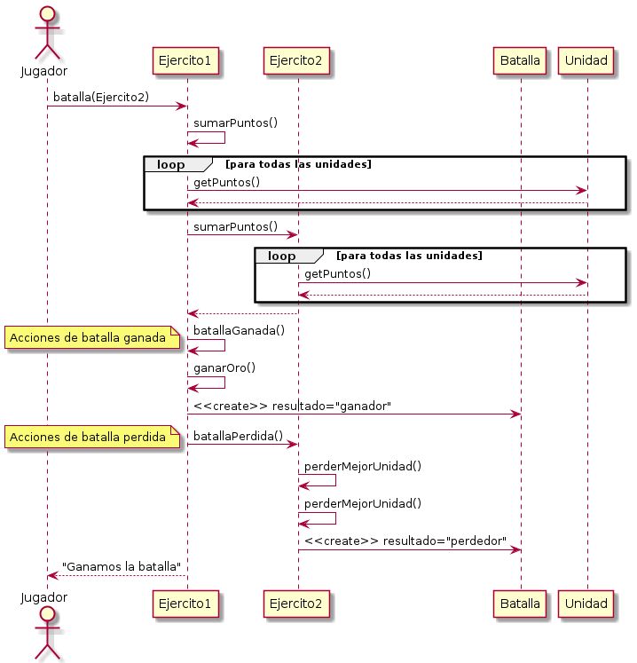
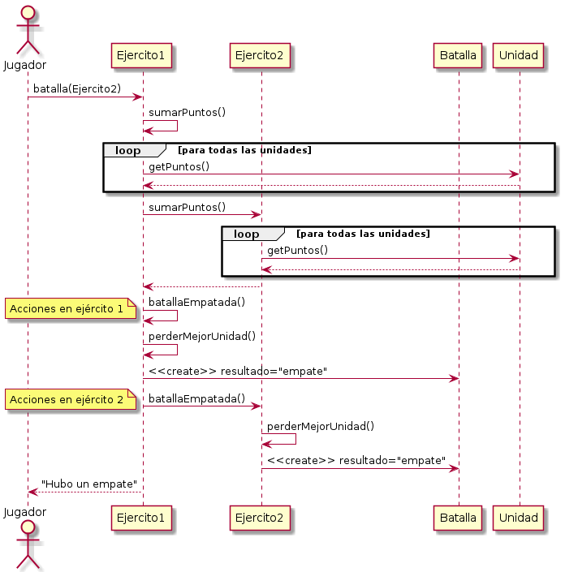

## Operación "ir a la batalla"

[Volver](README.md)

### Caso de uso 1 (alguien gana)

1. Se cuenta con dos ejércitos (bizantinos e ingleses) con las unidades creadas por defecto.
2. El jugador con el ejército bizantino ataca al ejército inglés.
3. Se suman los puntos de todas las unidades de cada ejército.
4. El ejército bizantino gana. Se suman 100 unidades de oro.
5. El ejército inglés pierde.
   1. Se ordenan las unidades por fuerza.
   2. Se eliminan las dos primeras (las que tienen más fuerza).
6. Se crea una batalla en cada ejército y se indica el resultado (ganador y perdedor).

### Caso de uso 2 (empate)

1. Se cuenta con dos ejércitos chinos con las unidades creadas por defecto.
2. Un jugador ataca, con su ejército, al otro ejército.
4. Se suman los puntos de todas las unidades de cada ejército.
5. Al resultar un empate, nadie gana oro.
   1. Se ordenan las unidades por fuerza.
   2. Se elimina a la unidad más fuerte de cada ejército.
6. Se crea una batalla en cada ejército y se indica el resultado (empate).

### Diagramas de secuencia

#### Caso 1

#### Caso 2

